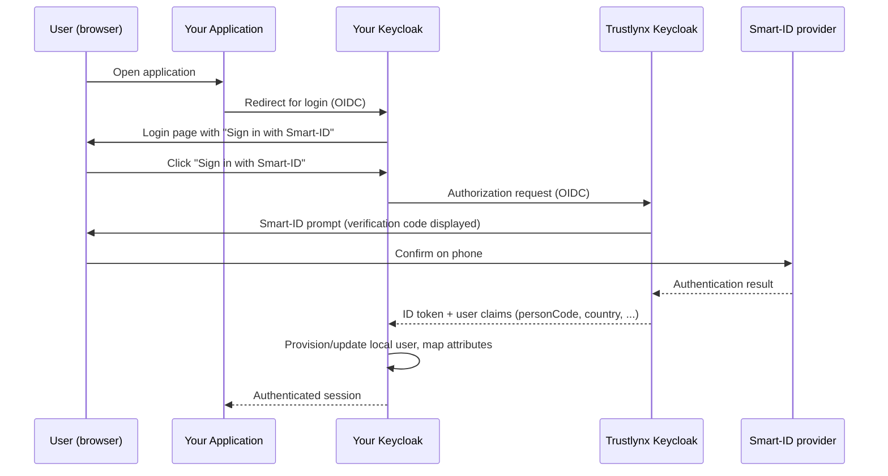

# Trustlynx Keycloak as External OpenID Connect Identity Provider (Smart-ID)

This guide explains how to configure your own Keycloak so that end users can sign in via **Smart-ID** by delegating authentication to a **Trustlynx Keycloak** instance acting as an external OpenID Connect Identity Provider (IdP).

You operate a Keycloak realm. Trustlynx operates a Keycloak realm that natively supports Smart-ID. By federating the two realms over OpenID Connect, your users get a "Sign in with Smart-ID" button that, when clicked, takes them through the Smart-ID flow on the Trustlynx side and returns them to your Keycloak with a verified identity.

---

## Table of contents

1. [Overview](#1-overview)
2. [Prerequisites](#2-prerequisites)
3. [Information exchange](#3-information-exchange)
4. [Create the Identity Provider in your Keycloak](#4-create-the-identity-provider-in-your-keycloak)
5. [Configure attribute (claim) mappers](#5-configure-attribute-claim-mappers)
6. [Configure the First Login Flow](#6-configure-the-first-login-flow)
7. [Testing and verification](#7-testing-and-verification)
8. [Troubleshooting](#8-troubleshooting)
9. [Appendix](#9-appendix)

---

## 1. Overview

### What you get

- A new login button on your Keycloak login page (e.g. **"Sign in with Smart-ID"**).
- When a user clicks it, they are redirected to the Trustlynx Keycloak, complete a Smart-ID challenge on their phone, and are returned to your Keycloak as an authenticated user.
- A user is auto-provisioned in your realm on first login. Subsequent logins reuse the same local account.
- Smart-ID identity attributes (national personal code, given name, surname, country, etc.) are imported as user attributes on your side and can be exposed downstream as claims to your applications.

### Authentication flow



### Compatibility

- **Your Keycloak**: tested against Keycloak 22+. Field labels in the admin console may differ slightly between versions; the procedure below applies to current admin UIs.
- **Trustlynx Keycloak**: Keycloak 26.x with Trustlynx Smart-ID extensions.
- **Protocol**: OpenID Connect 1.0 with Authorization Code flow.

---

## 2. Prerequisites

Before you start, make sure you have:

| # | Item | Notes |
| --- | --- | --- |
| 1 | Admin access to the target realm in **your** Keycloak | You will create an Identity Provider and (optionally) duplicate a flow. |
| 2 | Your Keycloak is reachable over **HTTPS** | The OIDC redirect URI must use `https://`. Smart-ID will not work reliably over plain HTTP. |
| 3 | Public reachability of your Keycloak's broker endpoint | Trustlynx Keycloak must be able to deliver the user back to `https://<your-keycloak-host>/realms/<your-realm>/broker/<idp-alias>/endpoint`. |
| 4 | OIDC client credentials issued by the **Trustlynx Keycloak operator** | See Section 3. |
| 5 | Confirmation that the Trustlynx-side OIDC client is bound to a **Smart-ID-only authentication flow** | This is configured by the Trustlynx Keycloak operator on their side. From your side, OIDC configuration is identical to any other OIDC IdP - you do not (and cannot) force "Smart-ID only" with a query parameter such as `kc_idp_hint`. |

---

## 3. Information exchange

This is a small handshake with whoever operates the Trustlynx Keycloak instance you will federate with.

### What you need to obtain from the Trustlynx Keycloak operator

| Item | Example shape | Used in |
| --- | --- | --- |
| Trustlynx Keycloak base URL | `https://<trustlynx-keycloak-host>` | OIDC discovery URL |
| Realm name | `<realm>` | OIDC discovery URL |
| OIDC discovery URL | `https://<trustlynx-keycloak-host>/realms/<realm>/.well-known/openid-configuration` | Step 4 |
| `client_id` | Customer-specific identifier | Step 4 |
| `client_secret` | Long random string - transport via secure channel (e.g. password manager, encrypted email) | Step 4 |
| Confirmation that the client is bound to a Smart-ID-only browser flow | Yes / No | Section 7 verification |

### What you need to send to the Trustlynx Keycloak operator

| Item | Example shape |
| --- | --- |
| Your broker redirect URI | `https://<your-keycloak-host>/realms/<your-realm>/broker/<idp-alias>/endpoint` |
| Your post-logout redirect URI (only if you use RP-initiated logout) | `https://<your-keycloak-host>/realms/<your-realm>/broker/<idp-alias>/endpoint/logout_response` |
| Which user attributes you need mapped (see Section 5) | Optional - a default subset works for most cases |

> **Important:** the `<idp-alias>` placeholder above must match exactly the alias you choose in [Step 4](#4-create-the-identity-provider-in-your-keycloak). If you change the alias later, you must re-send the new redirect URI to the operator.

---

## 4. Create the Identity Provider in your Keycloak

In your Keycloak admin console:

1. Select the target realm.
2. Navigate to **Identity Providers** → **Add provider** → **OpenID Connect v1.0**.
3. Fill in the fields below.

### Field reference

The `Source` column tells you where each value comes from:
- **From operator** - value provided by the Trustlynx Keycloak operator (Section 3).
- **Customer-chosen** - value you choose; affects URLs you must coordinate with the operator.
- **Fixed** - set to the value shown for this integration to work as designed.
- **Default** - keep the Keycloak default; listed only because it matters here.

| Field | Value | Source | Notes |
| --- | --- | --- | --- |
| Alias | e.g. `trustlynx-smartid` | Customer-chosen | Becomes part of the redirect URI you send to the operator. Avoid changing it after go-live. |
| Display Name | `Sign in with Smart-ID` | Customer-chosen | The label shown on your Keycloak login page. |
| Display Order | e.g. `0` | Customer-chosen | Position relative to other login methods. |
| Use discovery endpoint | `ON` | Fixed | |
| Discovery endpoint | `https://<trustlynx-keycloak-host>/realms/<realm>/.well-known/openid-configuration` | From operator | Click **Import** - Authorization, Token, Userinfo, JWKS and Issuer are filled in automatically. |
| Client authentication | `Client secret sent as post` | Fixed | |
| Client ID | `<client-id>` | From operator | |
| Client Secret | `<client-secret>` | From operator | Transport over a secure channel. |
| Default Scopes | `openid profile email` | Fixed | Space-separated. Add additional scopes only if explicitly instructed by the operator. |
| Prompt | *(leave blank)* | Default | Do **not** set this to `login` - it can break the Smart-ID flow. |
| Validate Signatures | `ON` | Fixed | |
| Trust Email | `ON` | Customer-choice | Recommended: Smart-ID identities are strongly verified, so you can treat email as trusted. |
| Store Tokens | `OFF` | Default | Enable only if downstream code needs to call the Trustlynx token / userinfo endpoints. |
| Stored Tokens Readable | `OFF` | Default | |
| Backchannel Logout | `OFF` | Default | Not required for the Smart-ID flow. |

> **Do not** rely on `kc_idp_hint` to force Smart-ID. Smart-ID is implemented as an authenticator on the Trustlynx side, not as a Keycloak Identity Provider, so `kc_idp_hint` does not apply. The "Smart-ID only" guarantee comes from the Trustlynx-side OIDC client being bound to a Smart-ID-only authentication flow (see Prerequisites #5).

### Save

Click **Save**. Your Identity Provider is now created; the next two sections wire up identity import behaviour.

---

## 5. Configure attribute (claim) mappers

Trustlynx Keycloak emits Smart-ID identity attributes as claims in the ID token. To make them available in your realm, create one **Attribute Importer** mapper per claim.

In the Identity Provider settings, open the **Mappers** tab and click **Add mapper** for each attribute below.

### Mapper template

| Field | Value |
| --- | --- |
| Sync Mode Override | `force` |
| Mapper Type | `Attribute Importer` (`oidc-user-attribute-idp-mapper`) |
| Claim | *(claim name from the table below)* |
| User Attribute Name | *(local attribute name from the table below - usually identical)* |

> **Why `force`?** With `force`, the local user attribute is updated on **every** login from the value in the incoming token. Without it (`import` mode), changes to the user's data on the Trustlynx side never reach your realm after first login. For identity data sourced from Smart-ID (legal name, etc.), `force` is the safer default.

### Required mappers

These cover the durable identity and the minimum profile data needed for most applications.

| # | Claim | Local user attribute | Purpose |
| --- | --- | --- | --- |
| 1 | `personCode` | `personCode` | National personal code. Part of the stable identity (see [Appendix B](#appendix-b-stable-identity-guidance)). |
| 2 | `country` | `country` | ISO country code of the personal code. Part of the stable identity. |
| 3 | `firstName` | `firstName` | Given name. Map to the built-in `firstName` user property if you want it on the standard profile. |
| 4 | `lastName` | `lastName` | Surname. Map to the built-in `lastName` user property if you want it on the standard profile. |
| 5 | `email` | `email` | Email address. Map to the built-in `email` user property. |
| 6 | `authProvider` | `authProvider` | The authentication method actually used. For Smart-ID logins this is `DM_SMART_ID` or `DM_SMART_ID_PLUS`. Useful for audit and policy decisions. |

### Optional mappers

Enable these only if your application needs them - privacy-minimise by default.

| # | Claim | Local user attribute | Purpose |
| --- | --- | --- | --- |
| 7 | `dateOfBirth` | `dateOfBirth` | Date of birth as a string. |
| 8 | `age` | `age` | Computed integer age at time of authentication. |
| 9 | `documentNumber` | `documentNumber` | ID document number. |
| 10 | `serialNumber` | `serialNumber` | Certificate serial number. |
| 11 | `phoneNumber` | `phoneNumber` | Phone number, when available. |
| 12 | `userAccount` | `userAccount` | Provider-side account reference. |

> **Do not** map the incoming `sub` or `preferred_username` claim onto your local username. On the Trustlynx side these are derived from a salted hash, are not human-readable, and are not portable across environments. Use `personCode` + `country` as the durable composite identifier - see [Appendix B](#appendix-b-stable-identity-guidance).

---

## 6. Configure the First Login Flow

Keycloak's default `first broker login` flow includes a **Review Profile** step that asks the user to confirm their email and username before the local account is created. For an IdP where identity has already been verified (Smart-ID), this extra step is unnecessary friction.

### Recommended setup

1. Go to **Authentication** → **Flows**.
2. Select **first broker login** and click **Duplicate**. Name the copy e.g. `first broker login (Smart-ID)`.
3. In the duplicated flow, find the **Review Profile** step and set its requirement to **Disabled**.
4. (Optional) In the duplicated flow, add a **Username Template Importer** sub-step (or configure it via the IdP mapper view in Step 5) using the template:
   ```
   ${ALIAS}.${CLAIM.personCode}.${CLAIM.country}
   ```
   This produces deterministic, collision-free local usernames such as `trustlynx-smartid.39001010001.EE`.
5. Go back to **Identity Providers** → your Trustlynx provider → **Settings** tab.
6. Set **First Login Flow** to your duplicated flow `first broker login (Smart-ID)`.
7. Save.

### Account linking on email collision

If a local user with the same email already exists when a Smart-ID user logs in for the first time, the default first-login flow will prompt them to link the existing account (typically by re-authenticating with their existing credentials). This behaviour is acceptable and recommended for most cases - leave it enabled unless you have a specific reason to fail closed.

---

## 7. Testing and verification

Run through this checklist end-to-end with a real Smart-ID test or production user.

1. Open an **incognito / private** browser window.
2. Navigate to your Keycloak account console at `https://<your-keycloak-host>/realms/<your-realm>/account`.
3. On the login page, confirm the **"Sign in with Smart-ID"** button (or whatever Display Name you chose) is visible.
4. Click it. Verify that:
   - The browser is redirected to `https://<trustlynx-keycloak-host>/realms/<realm>/...`.
   - The **Smart-ID prompt** appears immediately, showing a verification code.
   - You do **not** see a generic username/password form. If you do, the Trustlynx-side OIDC client is not bound to the Smart-ID-only flow - contact the Trustlynx Keycloak operator.
5. Confirm the Smart-ID challenge on your phone.
6. Verify that you are redirected back to your Keycloak and signed into the account console.
7. In the admin console, go to **Users** and locate the new user.
   - Open the **Attributes** tab.
   - Confirm that `personCode`, `country`, `firstName`, `lastName`, `email`, and `authProvider` are populated.
   - `authProvider` should be `DM_SMART_ID` or `DM_SMART_ID_PLUS`.
8. (Optional) Use a test client and decode the resulting ID token (e.g. with [jwt.io](https://jwt.io)) to confirm the same claims are present in your Keycloak's outbound tokens - exposing them to relying applications may require additional protocol mappers on **your** client (a separate concern, not covered here).

---

## 8. Troubleshooting

### `invalid redirect_uri` shown on the Trustlynx login page

The redirect URI your Keycloak is sending does not match what is registered on the Trustlynx-side OIDC client. Most often: you changed the Identity Provider **Alias** in Step 4 after sending the original URI to the operator. Re-send the corrected URI:
```
https://<your-keycloak-host>/realms/<your-realm>/broker/<idp-alias>/endpoint
```

### Smart-ID is not prompted - a generic username/password form appears instead

The Trustlynx-side OIDC client is not bound to a Smart-ID-only authentication flow. This is **not fixable from your side**. Contact the Trustlynx Keycloak operator and ask them to apply the Smart-ID-only browser flow override to your client.

### Signature validation failed / JWKS error

The cached signing keys for the Trustlynx Keycloak realm are stale (usually after a key rotation on the Trustlynx side).
- In your Keycloak admin console: **Identity Providers** → your provider → **Settings**.
- Click **Import from URL** again to refresh the JWKS.

### User is created but attributes are empty

Likely causes, in order of probability:
1. The mapper's **Sync Mode Override** is left at `import` instead of `force` - change it. The user will need to log in again before attributes appear.
2. The **Claim** name in the mapper is misspelled or has wrong casing. Claim names are case-sensitive - see Section 5 for exact spellings.
3. The Trustlynx-side OIDC client is not configured to emit the claim. Confirm with the operator.

### Duplicate user / email conflict

A local user with the same email already exists. The default first-login flow will offer account linking. If you want to merge automatically, enable **Trust Email** in the IdP settings (Step 4) and use a first-login flow variant that auto-links by email - this trades convenience for the small risk that the local pre-existing account was not actually owned by the Smart-ID user.

### How to collect diagnostics

Before opening a support request:
1. On your Keycloak server, enable `DEBUG` for the broker logger:
   ```
   org.keycloak.broker = DEBUG
   ```
2. Reproduce the failure.
3. Capture the `state` and `session_state` query parameters present in the URL of the **failed redirect back to your Keycloak**.
4. Share the log excerpt and those parameters with the Trustlynx Keycloak operator - they let the operator correlate the failure with their server-side logs.

---

## 9. Appendix

### Appendix A - Full claim reference

Claims emitted by Trustlynx Keycloak in the ID token / userinfo response for Smart-ID authentications:

| Claim | Type | Example value | Notes |
| --- | --- | --- | --- |
| `personCode` | string | `39001010001` | National personal code. |
| `country` | string | `EE` | ISO 3166-1 alpha-2 country code. |
| `firstName` | string | `JÕGEVA` | Given name as on Smart-ID certificate. |
| `lastName` | string | `TESTNUMBER` | Surname as on Smart-ID certificate. |
| `dateOfBirth` | string | `1990-01-01` | ISO date format. |
| `age` | int | `35` | Age at time of authentication. |
| `documentNumber` | string | `PNOEE-39001010001-MOCK-Q` | Provider-issued document identifier. |
| `serialNumber` | string | *(certificate-specific)* | Certificate serial number. |
| `email` | string | `user@example.com` | When available from the source. |
| `phoneNumber` | string | `+37200000000` | When available from the source. |
| `authProvider` | string | `DM_SMART_ID` | Authentication method used. Will be `DM_SMART_ID` or `DM_SMART_ID_PLUS` for Smart-ID. |
| `userAccount` | string | *(provider-specific)* | Provider-side account reference. |

### Appendix B - Stable identity guidance

The durable identity of a Smart-ID user is the **composite of `personCode` + `country`** - never the incoming `sub` or `preferred_username` claim. On the Trustlynx side, `sub`/username is derived from a salted hash and is not portable across environments or rotations.

When mapping Smart-ID users to internal identifiers (database keys, audit records, IAM rules), use:

```
identity = country + ":" + personCode
```

For example: `EE:39001010001`. This is unique, stable across sessions and across the user's lifetime, and consistent across all applications that authenticate against the same Trustlynx Keycloak instance.

### Appendix C - Defaults you may see

These are typical values you may receive from a Trustlynx Keycloak operator. They are **not contractual** - always use the values your operator actually provides.

| Item | Typical default | Notes |
| --- | --- | --- |
| Realm name | `trustlynx` | A single shared realm is common; some operators use per-customer realms. |
| Path prefix | `/auth/` may or may not be present in the base URL | Modern Keycloak (17+) drops `/auth/` by default; legacy deployments keep it. The discovery URL the operator gives you is authoritative. |
| Token lifespan | 5 minutes (access token) | Short access-token lifetimes are normal for high-assurance flows. |
| Default scopes | `openid profile email` | No additional scopes are required for the standard claim set in Appendix A. |
