# Smart-ID via Trustlynx, Client Integration Guide

## TL;DR

You operate your own Keycloak (typically the latest 26.x release) with your own realm (the same realm where your users already live, no new realm needed), your own users, and your own existing identity providers and clients. You want to let those users sign in via **Smart-ID**.

To enable that, your existing Keycloak federates over OpenID Connect with a **Trustlynx Keycloak**, a separate Keycloak that performs the actual Smart-ID flow. From the integration point of view, the Trustlynx Keycloak is just another OIDC Identity Provider, exactly like federating with Google, Microsoft, or any other OIDC IdP.

This guide describes only the OIDC integration step you perform on **your** Keycloak. It assumes the Trustlynx Keycloak is already reachable and that you have been given an OIDC discovery URL, `client_id`, and `client_secret` for it (Section 3 lists everything you should receive).

**The integration is scoped narrowly.** You add a new OIDC Identity Provider, six attribute mappers, and one duplicated authentication flow, all scoped to that new IdP. No existing identity provider, client, user, or authentication flow on your Keycloak is modified. The only realm-level change is in the realm's user profile config (Section 4.3, enabling unmanaged attributes so Smart-ID identity attributes can persist); this does not affect your existing users.

The procedure has been **verified end-to-end** against Keycloak 26.5.1 on the customer side. It applies to any Keycloak 22+. Admin console field labels may shift slightly between Keycloak major versions.

### How to read this guide

If you want to understand the **happy path** (a brand-new user signs in with Smart-ID for the first time): read §1, §2, §4.1-§4.4, §8.1.

If you want to understand **how an existing local user can sign in via Smart-ID and end up on their existing account, no duplicates**: that is the most common production case. The dedicated section is **§4.5 "Linking existing local users to Smart-ID"**. Supporting context lives in §4.2 (the seven IdP mappers, including the Username Template Importer that drives auto-link), §4.3 (realm user-profile policy), and §4.4 (the first-broker-login flow that performs the linking dialog). The end-to-end existing-user test, with screenshots, is **§8.2**.

### Prerequisites for the linking behaviour

Before any existing local user can be linked across local Keycloak ↔ Smart-ID:

- A working Trustlynx Keycloak deployment with an OIDC client for your Keycloak (operator-side; covered in §3).
- §4.1-§4.4 fully configured on your Keycloak: the IdP, the seven mappers (six attribute importers + one Username Template Importer), the realm user-profile policy, and the duplicated `first broker login (Smart-ID)` flow.
- The local user you want to link must be reachable by one of three routes detailed in §4.5. Listed best-first:
  - **Bulk rename** (Option 1, recommended) — you have an authoritative `(user, country, personCode)` data set and run the admin script in §4.5 once. After that, the user's first Smart-ID login is silent (no link button, no password prompt). This is what the §8.2 test demonstrates.
  - **Pre-created federated identity** (Option 2) — you have `(user, country, personCode, trustlynx-side sub)` data exported by the Trustlynx Keycloak operator. Same silent first-login experience as Option 1, but no username rename.
  - **Self-service linking** (Option 3, gap-filler) — for users you cannot pre-process. The user has a password set on their existing local account and clicks "Link account" themselves once in the Account Console. One extra step per user, no upfront ops action.

Without one of those routes for a given user, that user's first Smart-ID login will create a fresh local user with username `<country>.<personCode>` and leave their original local account untouched (a duplicate). §4.5 also covers how to detect and clean up duplicates if this happens.

---

## 1. Architecture

After integration you will run two Keycloak instances:

1. **Your existing Keycloak**, the one your applications already use, with your existing user base. No migration; your existing logins continue to work exactly as they did.
2. **The Trustlynx Keycloak**, used solely as the federated Identity Provider that performs Smart-ID. Your end users never log directly into it; they only ever pass through it during the Smart-ID step of an OIDC redirect.

The two are wired together over standard OpenID Connect: your existing Keycloak becomes an OIDC client of the Trustlynx Keycloak.

```
User browser
   │
   │ 1. opens your application
   ▼
Your Keycloak (existing) ──┐
                           │  "Sign in with Smart-ID" button
                           │
                           │ 2. browser redirect (OIDC authorize)
                           ▼
                Trustlynx Keycloak ──┐
                                     │  Smart-ID-only flow
                                     │
                                     │ 3. Smart-ID push to user's phone
                                     ▼
                            User confirms on phone
                                     │
                                     │ 4. browser redirect with auth code
                                     ▼
Your Keycloak ◄─────────────────────┘
   │  exchanges code for ID token, reads claims
   │  (personCode, country, firstName, ...),
   │  creates or updates a local user
   │
   │ 5. issues your own session/token to the application
   ▼
User signed in
```

Key properties:

- **Only your Keycloak makes outbound calls to the Trustlynx Keycloak** (for OIDC discovery and token exchange). All other traffic between the two is browser-driven (steps 2 and 4 in the diagram). The Trustlynx Keycloak never initiates a connection back to your Keycloak. This means you only need outbound HTTPS in one direction (covered by prerequisite #6); a VPN-gated or internally-resolvable customer Keycloak still works as long as users' browsers can reach it.
- **Your existing user base is untouched.** Smart-ID logins create new users in your realm (or link to existing ones on email match, configurable). Your username/password users continue to work.
- **The Trustlynx side has no awareness of your apps or your users.** From its perspective your Keycloak is just an OIDC client.
- **Smart-ID's specifics are entirely on the Trustlynx side.** Your Keycloak only consumes standard OIDC tokens.

---

## 2. Prerequisites

| # | Item | Notes |
| --- | --- | --- |
| 1 | Admin access to the target realm in **your** Keycloak | You will create an Identity Provider, customize one authentication flow, and adjust the realm user profile config. |
| 2 | Your Keycloak is reachable over **HTTPS** | The OIDC redirect URI you register on the Trustlynx side must use `https://`. |
| 3 | Public reachability of your Keycloak's broker endpoint | The user's browser must be able to reach `https://<your-keycloak-host>/realms/<your-realm>/broker/<idp-alias>/endpoint`. That endpoint is built into Keycloak; it appears automatically once you create the IdP in Section 4.1. |
| 4 | OIDC client credentials issued by the Trustlynx Keycloak operator | See Section 3. |
| 5 | Confirmation that the Trustlynx-side OIDC client is bound to a Smart-ID-only authentication flow | This is configured by the Trustlynx Keycloak operator. From your side, OIDC configuration is identical to any other OIDC IdP. |
| 6 | Network reachability between your Keycloak and the Trustlynx Keycloak | Your Keycloak host needs **outbound HTTPS** to the Trustlynx Keycloak hostname (for OIDC discovery and token exchange). Your end-users' browsers also need to reach the same hostname (for the redirect leg of the OIDC dance). Typical firewall rule: allow `443/tcp` from your Keycloak's egress to the Trustlynx Keycloak DNS name. |

---

## 3. Information exchange

Before you can configure your existing Keycloak (Section 4), an OIDC client must exist **inside the Trustlynx Keycloak** for your existing Keycloak to use. Creating that client is a one-time admin task on the Trustlynx side, performed by whoever administers it (the Trustlynx Keycloak operator).

> Throughout this guide, "the Trustlynx Keycloak operator" means your point of contact at Trustlynx during onboarding, or whoever on your side holds admin access to the deployed Trustlynx Keycloak after handover.

### Inputs you provide to the Trustlynx Keycloak operator

| Item | Format | Source |
| --- | --- | --- |
| Your existing Keycloak's broker redirect URI | `https://<your-keycloak-host>/realms/<your-realm>/broker/<idp-alias>/endpoint` | You choose `<idp-alias>` in Step 4.1. The host and realm are your existing Keycloak's. |
| Optional: post-logout redirect URI | `https://<your-keycloak-host>/realms/<your-realm>/broker/<idp-alias>/endpoint/logout_response` | Only if you use RP-initiated logout. |
| List of optional claims required by your applications | See Section 5 | The default subset is enough for most cases. |

### Outputs you receive from the Trustlynx Keycloak operator

These are the values you will paste into your existing Keycloak's Identity Provider configuration in Section 4.1.

| Item | Format | Where it comes from |
| --- | --- | --- |
| OIDC discovery URL of the Trustlynx Keycloak | provided by operator | A standard OIDC discovery URL of the form `https://<host>/.../realms/<realm>/.well-known/openid-configuration`. Use the exact URL the operator hands you, paths can vary by deployment. Sanity-check it with `curl -fsS <discovery-url>`, you should get HTTP 200. |
| `client_id` | string (e.g. `your-keycloak-prod`) | Created in the Trustlynx Keycloak admin console. |
| `client_secret` | random string generated by Keycloak | Issued when the client is created. **Treat as a secret**: store in a password manager or your secret store, never commit to git. |
| Confirmation that the OIDC client is bound to a Smart-ID-only authentication flow | yes / no | Configured at client-creation time on the Trustlynx Keycloak side, see the next subsection. |

### Trustlynx-side OIDC client must be bound to a Smart-ID-only flow

When the OIDC client is created in the Trustlynx Keycloak, its **Authentication Flow Override > Browser** should be set to the Smart-ID-only flow that the Trustlynx side provides. Without this binding, users redirected from your Keycloak will see a generic username/password form on the Trustlynx Keycloak instead of the Smart-ID prompt, which means the federation will not deliver the value you expect.

If the Trustlynx-provided realm has the Smart-ID-only flow as the realm-level default browser flow, no per-client override is needed. The Trustlynx Keycloak operator confirms which arrangement applies to your deployment.

> The `<idp-alias>` placeholder must match exactly the alias you choose in Step 4.1. If you change the alias later, you must update the redirect URI registered on the Trustlynx-side OIDC client.

---

## 4. Configuration in your Keycloak

### Before you begin, pre-flight

Have these four values open in front of you (you collected them in Section 3):

- The **OIDC discovery URL** of the Trustlynx Keycloak
- The **`client_id`**
- The **`client_secret`** (treat as sensitive)
- The IdP **alias** you intend to use (e.g. `trustlynx-smartid`); this becomes part of your broker redirect URI

Quick connectivity sanity-check from your Keycloak host before you start clicking around the admin console:

```bash
curl -fsS "<discovery-url>" | head -c 200
```

You should get HTTP 200 and a JSON document beginning `{"issuer":"...","authorization_endpoint":"..."}`. If you get a connection error or a non-200 response, fix that first; see prerequisite #6 (network reachability) and the discovery URL note in Section 3.

### 4.1. Add the OpenID Connect Identity Provider

In your Keycloak admin console:

1. Select the target realm.
2. **Identity Providers > Add provider > OpenID Connect v1.0**.
3. Fill in the fields below. The `Source` column tells you where each value comes from:
   - **From operator**: value provided by the Trustlynx Keycloak operator.
   - **You choose**: value you choose; affects URLs you must coordinate with the operator.
   - **Fixed**: set to the value shown for this integration to work as designed.
   - **Default**: keep the Keycloak default.

| Field | Value | Source | Notes |
| --- | --- | --- | --- |
| Alias | e.g. `trustlynx-smartid` | You choose | Becomes part of the redirect URI you send to the operator. Avoid changing it after go-live. |
| Display Name | `Sign in with Smart-ID` | You choose | The label shown on your Keycloak login page. |
| Display Order | e.g. `0` | You choose | Position relative to other login methods. |
| Use discovery endpoint | `ON` | Fixed | |
| Discovery endpoint | provided by operator | From operator | Click **Import**: Authorization, Token, Userinfo, JWKS and Issuer fill in automatically. |
| Client authentication | `Client secret sent in the request body` | Fixed | This is the Keycloak 26 label for what older versions called "Client secret sent as post". Both refer to the same `client_secret_post` OIDC token-endpoint auth method. |
| Client ID | provided by operator | From operator | |
| Client Secret | provided by operator | From operator | Transport over a secure channel. |
| Default Scopes | `openid profile email` | Fixed | Space-separated. Add additional scopes only if explicitly instructed by the operator. |
| **PKCE Method** *(in Advanced settings)* | `S256` (turn the toggle on) | **Fixed, required** | Without this you will get `invalid_request: Missing parameter: code_challenge_method` from the Trustlynx side. |
| Validate Signatures | `ON` | Fixed | |
| Trust Email | `ON` | You choose | Recommended: Smart-ID identities are strongly verified, so you can treat email as trusted. |
| Sync Mode *(in Advanced settings)* | `Force` | Fixed | Each login refreshes user attributes from the IdP claims. The required attribute mappers below also use Force mode. |
| Store Tokens | `OFF` | Default | Enable only if downstream code needs to call the Trustlynx token or userinfo endpoints. |
| Backchannel Logout *(in Advanced settings)* | `OFF` | Default | Logging your user out of your Keycloak does **not** also log them out of the Trustlynx Keycloak. The Trustlynx-side session is invisible to users (they never log in there directly) and expires on its own. Most customers leave this off. |

> **Important, PKCE.** The Trustlynx-side OIDC client requires PKCE with method `S256`. This is a hard requirement for the integration to work. The corresponding setting on your Keycloak Identity Provider is sometimes labelled "Use PKCE" / "Proof Key for Code Exchange" / "PKCE Code Challenge Method". Set it ON with method `S256`.

> Do **not** set the **Prompt** field to `login`. It can break the Smart-ID flow.

> Do **not** rely on `kc_idp_hint` to force Smart-ID. Smart-ID is implemented as an authenticator on the Trustlynx side, not as a Keycloak Identity Provider, so `kc_idp_hint` does not apply. The "Smart-ID only" guarantee comes from the Trustlynx-side OIDC client being bound to a Smart-ID-only authentication flow.

#### What the configured IdP looks like

General settings, top of the form:

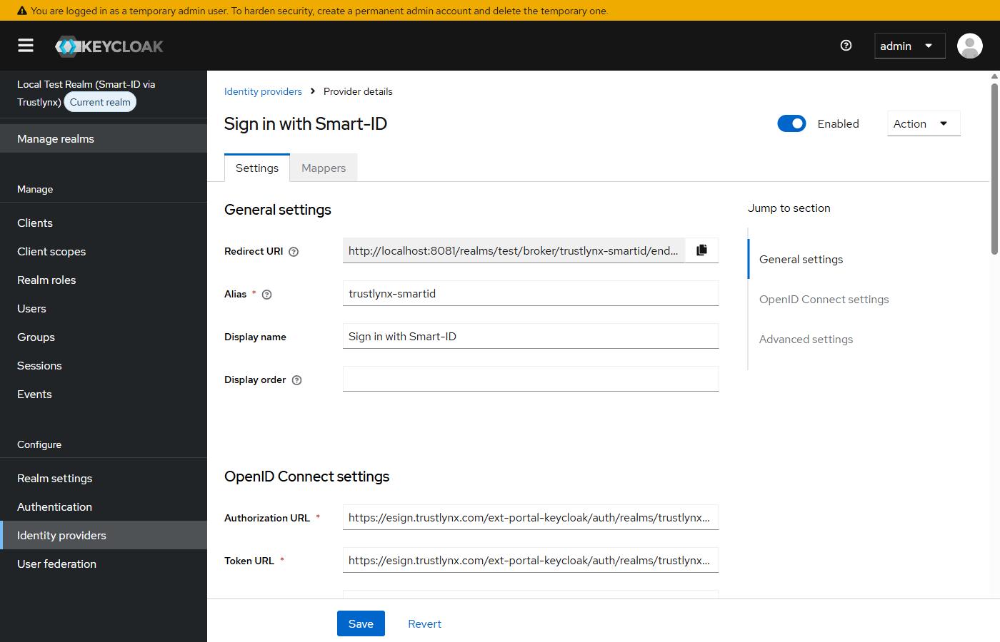

PKCE and client authentication, mid-form (the section your operator-issued credentials go into):

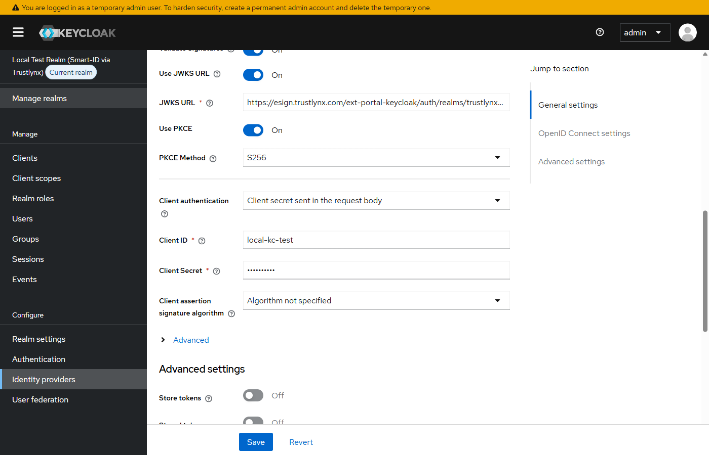

Advanced settings, where Trust Email and the First login flow override live:

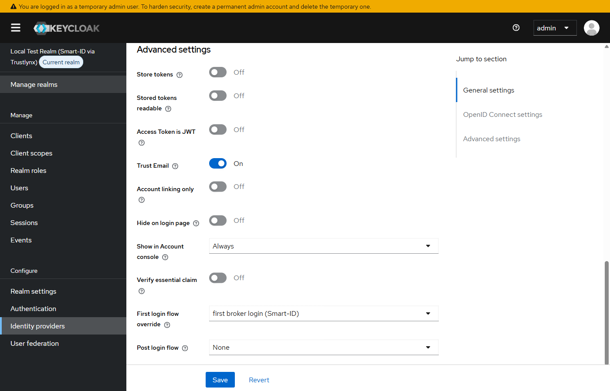

And further down the same Advanced settings panel, Sync mode = Force:

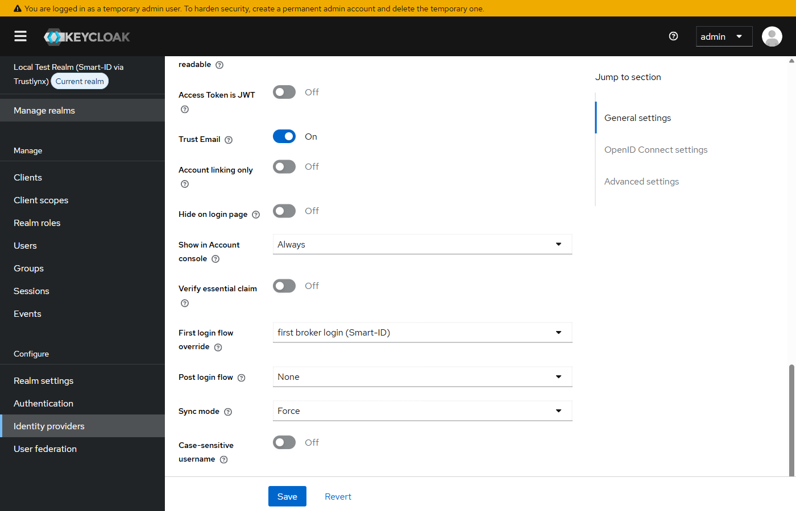

Save. The IdP is created and appears in the Identity Providers list:

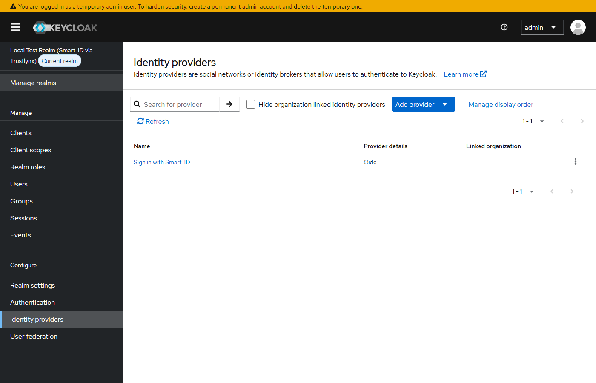

The next sections wire up identity import behaviour.

---

### 4.2. Required attribute (claim) mappers

Open the Identity Provider you just created, then open the **Mappers** tab and click **Add mapper** for each row below.

#### Common mapper template

| Field | Value |
| --- | --- |
| Sync Mode Override | `force` |
| Mapper Type | `Attribute Importer` (`oidc-user-attribute-idp-mapper`) |
| Claim | *(claim name from the table below)* |
| User Attribute Name | *(local attribute name from the table below, usually identical)* |

> **Why `force`?** With `force`, the local user attribute is updated on **every** login from the value in the incoming token. Without it (`import` mode), changes to the user's data on the Trustlynx side never reach your realm after first login. For identity data sourced from Smart-ID, `force` is the safer default.

#### Required mappers

| # | Claim | Local user attribute | Purpose |
| --- | --- | --- | --- |
| 1 | `personCode` | `personCode` | National personal code. Part of the stable identity (see Section 7). |
| 2 | `country` | `country` | ISO country code of the personal code. Part of the stable identity. |
| 3 | `firstName` | `firstName` | Given name. Maps to the standard Keycloak `firstName` field. |
| 4 | `lastName` | `lastName` | Surname. Maps to the standard Keycloak `lastName` field. |
| 5 | `email` | `email` | Email address (when available, see Section 6). Smart-ID itself does not return email; this mapper is harmless and useful for forward compatibility with other auth methods that do return email (Mobile-ID, eID). |
| 6 | `authProvider` | `authProvider` | The authentication method used. For Smart-ID logins this is `DM_SMART_ID` or `DM_SMART_ID_PLUS`. Useful for audit and policy. |

#### Optional mappers

Enable these only if your application needs them; privacy-minimise by default.

| # | Claim | Local user attribute | Purpose |
| --- | --- | --- | --- |
| 7 | `dateOfBirth` | `dateOfBirth` | Date of birth as a string. |
| 8 | `age` | `age` | Computed integer age at time of authentication. |
| 9 | `documentNumber` | `documentNumber` | ID document number. |
| 10 | `serialNumber` | `serialNumber` | Certificate serial number. |
| 11 | `phoneNumber` | `phoneNumber` | Phone number, when available. |
| 12 | `userAccount` | `userAccount` | Provider-side account reference. |

> **Do not** map the incoming `sub` or `preferred_username` claim onto your local username. On the Trustlynx side these are derived from a salted hash, are not human-readable, and are not portable across environments. Use `personCode` + `country` as the durable composite identifier (see Section 7).

#### What the Mappers tab looks like after you have added all six

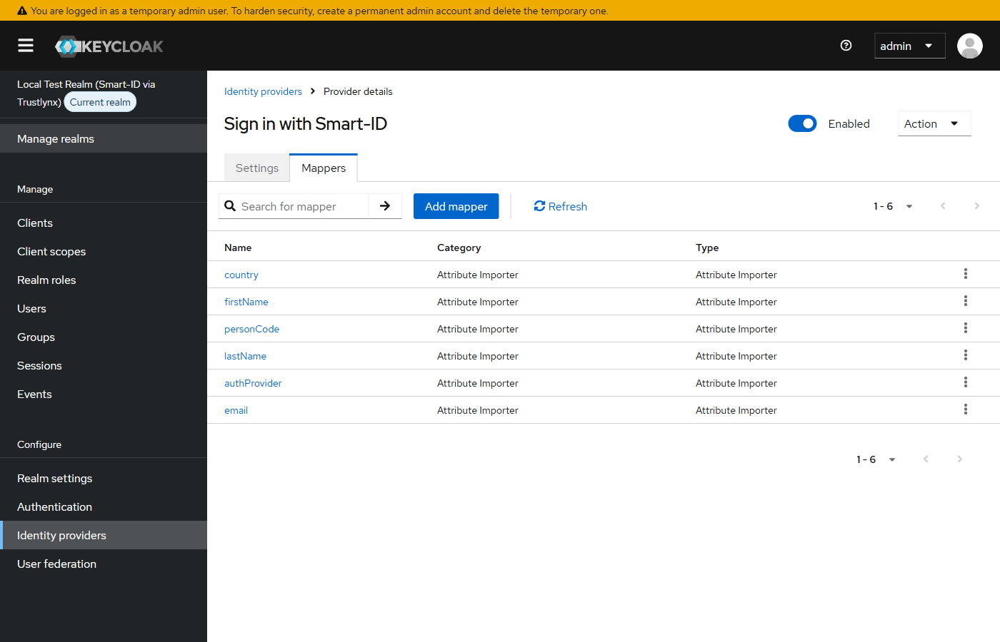

A single mapper detail view, the personCode mapper opened so you can see the four fields you set:

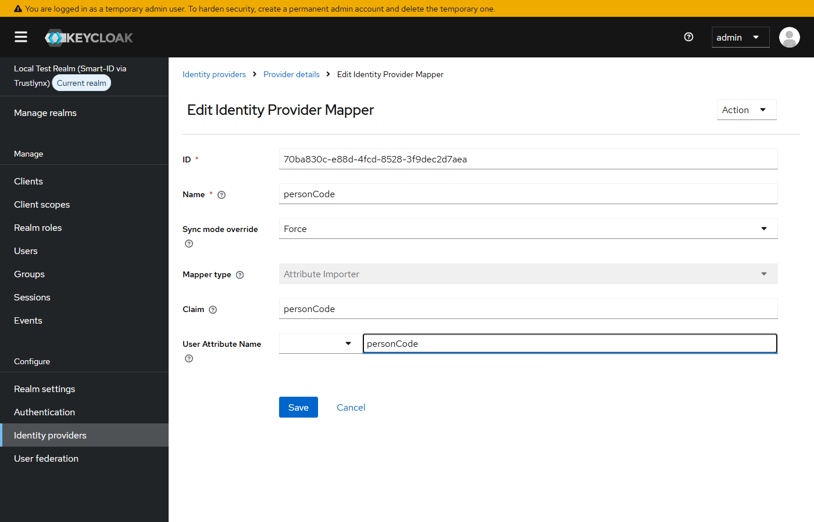

---

### 4.3. Realm user profile, required for Keycloak 22+

Keycloak 22 introduced a declarative user profile, and from Keycloak 26 it is enabled by default. **Custom attributes that are not declared in the user profile are silently dropped**. So without this step, `personCode`, `country`, `authProvider` etc. will appear to be ignored even though the mappers in Step 4.2 fired.

You have two options.

#### Option A, enable unmanaged attributes (simplest)

1. **Realm settings > General** tab. (In Keycloak 26 the toggle lives on the General tab; in earlier versions it was under the User profile tab.)
2. Scroll to the **Unmanaged Attributes** dropdown. Set it to **Enabled** (the value labelled simply "Enabled", not "Admin can edit" or "Admin can view").
3. Save.

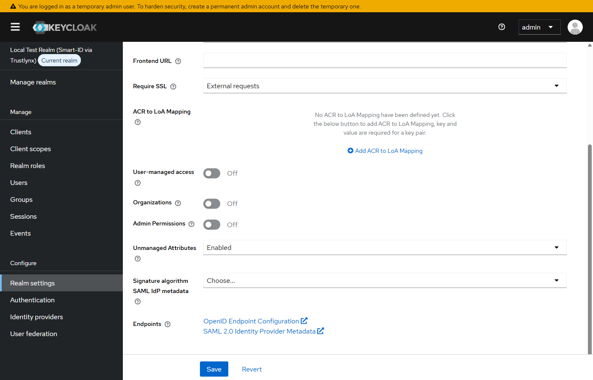

This allows arbitrary user attributes to persist. Recommended for the test phase and for most production deployments.

#### Option B, declare each custom attribute (stricter)

1. **Realm settings > User profile** tab.
2. **Create attribute** for each of `personCode`, `country`, `authProvider`, and any optional claims you mapped.
3. For each, set permissions appropriate to your realm (typically: view by `admin` and `user`; edit by `admin`).
4. Save.

Use this option if your security policy requires every attribute to be explicitly declared.

> If you skip this step entirely, `firstName`, `lastName`, and `email` will work (they are built-in user properties), but `personCode`, `country`, `authProvider` will be missing from your users, which usually breaks downstream consumers and audit.

---

### 4.4. First Login Flow, disable Review Profile

Keycloak's default `first broker login` flow includes a **Review Profile** step that asks the user to confirm their email and username before the local account is created. For an IdP where identity has already been verified by Smart-ID, this is unnecessary friction.

Recommended setup:

1. **Authentication > Flows**.
2. Select **first broker login** and click **Duplicate**. Name the copy e.g. `first broker login (Smart-ID)`.
3. In the duplicated flow, find the **Review Profile** step and set its requirement to **Disabled**.
4. **Identity Providers >** your Trustlynx provider **> Settings** tab.
5. Set **First Login Flow** to your duplicated flow.
6. Save.

After step 3, the duplicated flow's tree should look like this, with Review Profile shown as **Disabled**:

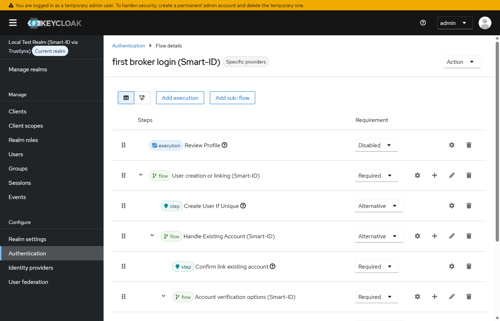

> **Note for Keycloak 26+.** If you are creating the duplicated flow programmatically (realm import, Terraform, scripts), do not include `conditional-otp-form` as an authenticator. It does not exist in modern Keycloak. The OTP path is an optional sub-flow built from `conditional-credential` + `auth-otp-form`. For an IdP-federated login that is already strongly authenticated by Smart-ID, the entire OTP sub-flow is usually redundant and can be omitted.

#### Silent auto-link when a local user already exists

Smart-ID does not return an email, so email-based collision detection alone cannot link a Smart-ID login to a pre-existing local account. The realm export bundles two pieces that solve this:

- A **Username Template Importer mapper** (§4.2) that produces deterministic local usernames `<country>.<personCode>` (e.g. `LV.180000-12345`).
- A **silent auto-link sub-flow** in this duplicated `first broker login (Smart-ID)` flow, built from Keycloak's `idp-detect-existing-broker-user` + `idp-auto-link` authenticators. When a local user with the matching username (or email) is found, the Smart-ID identity is attached to that user automatically — **no "Account already exists" prompt, no password challenge**. The user lands directly on their existing account.

Why no password challenge: Smart-ID is itself a strong identity proof (PIN1 on the registered phone). Adding a separate local-password verification on top would be friction without meaningful security gain. Most production rollouts pick this silent shape.

Three cases:

- **Pre-existing local user with username matching `<country>.<personCode>`.** Auto-link fires silently. The user lands on their existing account. The `FORCE` sync overwrites `firstName`/`lastName` from Smart-ID; existing email is preserved.
- **Pre-existing local user with a matching email.** Same path — auto-link finds the user by email. Most useful for IdPs that *do* emit email (Mobile-ID, eID).
- **No matching local user.** A fresh local user is created with username `<country>.<personCode>`.

Existing username/password users are completely unaffected by this integration: they continue to log in via the password form on your existing login page, and their accounts are never touched unless they themselves authenticate via Smart-ID with a matching personCode (or matching email).

If you prefer the **password-prompt-on-link** behaviour instead (Keycloak's classic "Add to existing account" challenge before attaching the IdP), replace the auto-link sub-flow in your duplicated flow with the built-in `Handle Existing Account` sub-flow. That trades user friction (one extra password screen on first Smart-ID login per existing user) for an additional ownership check.

> **Operational note for existing customers.** If you migrated to this integration mid-flight and already have Smart-ID users in your realm with old hash-style usernames, the `INHERIT` sync mode on the username mapper rewrites their username to `<country>.<personCode>` on their next Smart-ID login. Plan for that one-time username churn during your rollout window.

For the **realistic case** where your realm already has users with arbitrary usernames (e.g. `alice@company.com`) and you want them to start using Smart-ID without creating duplicates, see the dedicated §4.5 below.

---

### 4.5. Linking existing local users to Smart-ID

If your realm already contains users (your existing customers, employees, etc.) and you want them to use Smart-ID for sign-in **without creating a duplicate user record per person**, you need to plan a one-time linking strategy. This is where most rollouts land in practice — almost every existing Keycloak realm has users whose usernames are *not* in `<country>.<personCode>` form.

The goal of this section is for the end user **not to know that anything has changed**. The user opens the login page, sees the new "Sign in with Smart-ID" button, clicks it, confirms on their phone, and is signed in to their existing account. No popup, no extra password challenge, no "click here to link" detour. That's a real product launch experience, not a migration ceremony. Options 1 and 2 below deliver that experience; Option 3 does not (it requires one extra user-facing action, used only as a fallback for users you cannot pre-process).

#### Why this matters: the duplicate-user trap

Smart-ID does not return an email claim. Without an email match, Keycloak's built-in `Create User If Unique` authenticator falls back to checking the username instead. The realm export ships with a Username Template Importer mapper that builds the local username from incoming claims as `<country>.<personCode>` (e.g. `LV.180000-12345`).

- If your existing user's username happens to match that template → auto-link kicks in (the flow described in §4.4).
- If your existing user's username is `alice@company.com` or `alice` or anything else → no match, no link, and Keycloak silently creates a brand-new second user when the person logs in via Smart-ID. The original user record is untouched. **Two records per person.**

How to detect duplicates after the fact: in the admin console open **Users** and filter by username. Smart-ID-created users have lowercased usernames of the form `lv.180487-10948`. Original users keep your existing username format. If both rows exist for the same human, you have a duplicate.

#### Pre-link checklist

Before any user starts linking:

- [ ] Sections 4.1-4.4 are complete: the IdP, the seven mappers (six attribute importers + one username template importer), the realm user profile policy, and the duplicated `first broker login (Smart-ID)` flow are all configured.
- [ ] You have decided which existing users will migrate to Smart-ID (and which won't). Users not migrating stay as-is and continue to log in by username/password.
- [ ] For Option 1 or Option 2 (the silent paths): you have a `personCode` and `country` for each migrating user (HR record, CRM, or prior data import).
- [ ] You have informed your support team that any users you can't reach via Option 1 or Option 2 will need to be guided through Option 3 (Account Console + Link account button), and that those users should NOT click "Sign in with Smart-ID" before linking — otherwise a duplicate is created.

#### Choose your option

| Option | User experience on first Smart-ID login | Upfront work for ops | Best when |
| --- | --- | --- | --- |
| 1. **Bulk rename** to `<country>.<personCode>` *(recommended)* | **Silent.** User clicks "Sign in with Smart-ID", confirms on phone, lands on existing account. No prompts, no extra clicks. | One admin script run before any user signs in via Smart-ID | You have an authoritative `(user, country, personCode)` data set (HR, CRM). This is what the realm export and §8.2 test demonstrate. |
| 2. **Pre-create federated identity links** | **Silent** (identical to Option 1). | Admin script run before any user signs in via Smart-ID, plus an `(personCode, sub)` data export from the Trustlynx Keycloak operator | You don't want to rename usernames AND you can negotiate the `sub` export from the Trustlynx Keycloak operator. |
| 3. **Self-service linking** *(last resort, only for users not covered by Option 1 or 2)* | **Not silent.** The user has to: sign in to Account Console with their existing password → navigate to a setting page → click a "Link account" button → go through Smart-ID phone confirmation. One extra ceremony per user. | None | You have no personCode data for some users (so they can't be pre-renamed or pre-linked) and the only remaining route is having those users do the work themselves. |

**Pick Option 1 or Option 2** if you can. Both deliver the silent end-user experience the integration was designed for. Option 1 is the simpler of the two (rename script vs. data export negotiation with the Trustlynx operator).

**Use Option 3 only as a fallback** for the subset of users where Options 1 and 2 are not possible (e.g. you genuinely have no personCode for them). The end-user experience is poorer because they have to take an explicit "Link account" action — which means you also need an announcement, an FAQ, and support capacity for users who don't read the announcement.

#### Option 1: Bulk rename existing users to `<country>.<personCode>` (recommended)

Use this when you have an authoritative data set mapping each existing user to their `personCode` + `country`. After the rename, Smart-ID silently auto-links on the user's first Smart-ID login. **No "Link account" button, no password prompt, no Update Account form.** This is the user experience demonstrated in the §8.2 test (screenshot 15).

Prerequisites:

- A CSV of `(user-identifier, country, personCode)`. The user identifier is whatever the admin API can look up by — usually `email` or `username`. Example:
  ```csv
  alice@company.com,LV,180487-10948
  bob@company.com,EE,39001010001
  ```
- Admin user with `manage-users` privilege in your realm.
- Bash + `curl` + `jq` available on your admin host.

Example script:

```bash
#!/bin/bash
set -e
KC=https://<your-keycloak-host>
REALM=<your-realm>
ADMIN_USER=admin
ADMIN_PASS='<admin-password>'
INPUT=users.csv  # format: email,country,personCode

# 1. Get an admin token
TOKEN=$(curl -s -X POST "${KC}/realms/master/protocol/openid-connect/token" \
  -d "grant_type=password" -d "client_id=admin-cli" \
  -d "username=${ADMIN_USER}" -d "password=${ADMIN_PASS}" \
  | jq -r .access_token)

# 2. Loop the CSV, rename each user
while IFS=, read -r email country personCode; do
  USER_ID=$(curl -s -H "Authorization: Bearer $TOKEN" \
    "${KC}/admin/realms/${REALM}/users?email=${email}&exact=true" \
    | jq -r '.[0].id // empty')
  if [ -z "$USER_ID" ]; then
    echo "WARN: no user with email ${email}"; continue
  fi
  NEW_USERNAME="${country}.${personCode}"
  HTTP=$(curl -s -o /dev/null -w "%{http_code}" \
    -X PUT "${KC}/admin/realms/${REALM}/users/${USER_ID}" \
    -H "Authorization: Bearer $TOKEN" -H "Content-Type: application/json" \
    -d "{\"username\":\"${NEW_USERNAME}\"}")
  if [ "$HTTP" = "204" ]; then
    echo "OK:   ${email} -> ${NEW_USERNAME}"
  else
    echo "FAIL: ${email} -> ${NEW_USERNAME} (HTTP ${HTTP})"
  fi
done < "${INPUT}"
```

Verification:

- Browse the realm **Users** tab in the admin console; renamed users should show username `<country>.<personCode>`.
- Have one user log in via "Sign in with Smart-ID". Confirm: after the trustlynx phone confirmation, the user lands directly on their existing account — **no "Account already exists" prompt, no password challenge** (the silent auto-link sub-flow described in §4.4 handles linking transparently). After the flow, `GET /admin/realms/<your-realm>/users/<user-id>/federated-identity` should list `trustlynx-smartid`.

Risks and mitigations:

- **Username collision on rename** (rare): two existing users would end up with the same `<country>.<personCode>`. The `PUT` returns HTTP 409. The script logs FAIL — investigate manually before retrying.
- **Wrong personCode in CSV** (typo, mismatch): the user's first Smart-ID login won't match (because Smart-ID returns the *correct* personCode), and a duplicate user is created. Detect via the cleanup procedure below.
- **Users who logged in by username** (rather than email) need to know their username changed. Communicate. If they only ever log in by email, no impact.

#### Option 2: Pre-create federated identity links via admin API

Skip the username dance. For each existing user, attach the Smart-ID federated identity directly. After this, the user's first Smart-ID login lands on their existing user with no first-broker-login prompt at all (Keycloak finds the federated identity and signs them straight in). Same end-user experience as Option 1 (silent first sign-in), but the existing usernames stay unchanged.

Prerequisites:

- Same data as Option 1 (`(user-identifier, country, personCode)` mapping).
- Plus the **trustlynx-side `sub`** value for each user. This is a deterministic salted hash of `personCode + country` computed on the trustlynx side. The customer cannot generate it without knowing the salt and hash function used by the Trustlynx Keycloak — which means you need an out-of-band data export from the **Trustlynx Keycloak operator**: a CSV of `(personCode, country, sub)` for each user the operator already knows about.

Example script:

```bash
#!/bin/bash
set -e
KC=https://<your-keycloak-host>
REALM=<your-realm>
IDP_ALIAS=trustlynx-smartid
ADMIN_USER=admin
ADMIN_PASS='<admin-password>'
INPUT=users.csv  # format: email,trustlynx_sub

TOKEN=$(curl -s -X POST "${KC}/realms/master/protocol/openid-connect/token" \
  -d "grant_type=password" -d "client_id=admin-cli" \
  -d "username=${ADMIN_USER}" -d "password=${ADMIN_PASS}" \
  | jq -r .access_token)

while IFS=, read -r email sub; do
  USER_ID=$(curl -s -H "Authorization: Bearer $TOKEN" \
    "${KC}/admin/realms/${REALM}/users?email=${email}&exact=true" \
    | jq -r '.[0].id // empty')
  if [ -z "$USER_ID" ]; then echo "WARN: ${email} not found"; continue; fi
  HTTP=$(curl -s -o /dev/null -w "%{http_code}" \
    -X POST "${KC}/admin/realms/${REALM}/users/${USER_ID}/federated-identity/${IDP_ALIAS}" \
    -H "Authorization: Bearer $TOKEN" -H "Content-Type: application/json" \
    -d "{\"identityProvider\":\"${IDP_ALIAS}\",\"userId\":\"${sub}\",\"userName\":\"${sub}\"}")
  echo "${email}: HTTP ${HTTP}"
done < "${INPUT}"
```

Verification:

- `GET /admin/realms/<your-realm>/users/<user-id>/federated-identity` returns one entry with `identityProvider: trustlynx-smartid` and the `userId` matching what was inserted.
- A user's first Smart-ID login goes straight through with no first-broker-login prompts and lands on their existing user.

When to use Option 2 over Option 1:

- You don't want to rename usernames (existing applications hard-code the old username format and you can't change them quickly).
- You can negotiate the `(personCode, sub)` data export with the Trustlynx Keycloak operator.

When **not** to use Option 2:

- You can't get the `sub` data → use Option 1 (rename) or Option 3 (self-service) instead.

#### Option 3: Self-service linking (gap-filler)

Use this for users you cannot pre-process under Option 1 or Option 2. Each affected user does the link themselves through the Account Console. Useful when you don't have personCode data, want to spread the rollout over time, or have stragglers.

Step-by-step, for each user:

1. They open the Account Console at:
   ```
   https://<your-keycloak-host>/realms/<your-realm>/account/
   ```
2. They sign in with their **existing** username and password (the way they always have).
3. In the left navigation: **Account security** → **Linked accounts**.
4. They see a row for "Sign in with Smart-ID" with a **Link account** button. They click it.
5. The browser is redirected to the Trustlynx Keycloak. Smart-ID flow runs (country tab → personal code → phone confirmation).
6. After Smart-ID confirmation the browser returns to the Account Console; the "Sign in with Smart-ID" entry now shows as linked.
7. From the next sign-in onwards, the user can click "Sign in with Smart-ID" on the login page and land on the same account, no password needed.

When this is appropriate:

- You don't have a personCode-to-user data set, so Options 1 and 2 are not feasible.
- You want to spread linking over a longer rollout window so support load is gradual.
- A subset of users were missed by your Option 1 / Option 2 migration script and need a manual finish.

Costs and constraints:

- The user has to take an explicit action once. Communicate this with an announcement and a short user-facing FAQ.
- The user must have a password set on their existing local account (so they can sign in to the Account Console first). If they do not (e.g. they were provisioned via SSO from another upstream IdP and have no local password), Option 3 doesn't work for them — use Option 1 or Option 2 instead.
- If the user attempts a "Sign in with Smart-ID" *before* doing the link from the Account Console, a fresh Smart-ID-provisioned user is created (the silent auto-link can't match anything) and you're now in the duplicate-user case. Resolve via the cleanup procedure at the end of this section.

#### Verifying the linking worked

Across all three options, three checks confirm the rollout is clean:

1. **Realm user-count test.** Note your user count before rollout: `GET /admin/realms/<your-realm>/users/count`. After Smart-ID rollout to N users, the count must still be the same (zero duplicates). If higher → some users went down the duplicate path (one of the failure modes above). Investigate.
2. **Per-user federated-identity check.** For any specific user: `GET /admin/realms/<your-realm>/users/<user-id>/federated-identity` should list `trustlynx-smartid` once they've completed linking.
3. **Real login.** The user clicks "Sign in with Smart-ID" → after the trustlynx flow they land on **their** existing account (their existing email and username are preserved; the `FORCE` sync overwrites their `firstName`/`lastName` to the Smart-ID certificate values, and adds `personCode`, `country`, `authProvider` as attributes).

#### Cleanup if a duplicate accidentally gets created

This happens when a user signs in via Smart-ID before their account was linked under any of the three options. The result: a new user with username `lv.<personCode>` (lowercased) and the Smart-ID identity attached, while their original user (e.g. `alice@company.com`) sits unlinked. To merge them:

1. Identify the duplicate. Admin console **Users** → filter by username pattern (e.g. starts with `lv.` or your country code) or by created date. Note its user id (`<DUP_ID>`).
2. Find the original user (the one with the company username/email). Note its user id (`<ORIG_ID>`).
3. Read the duplicate's federated identity to capture the trustlynx-side `sub`:
   ```bash
   curl -s -H "Authorization: Bearer $TOKEN" \
     "${KC}/admin/realms/${REALM}/users/${DUP_ID}/federated-identity" | jq
   ```
   Save the `userId` field — that's the trustlynx-side `sub`.
4. Detach the federated identity from the duplicate:
   ```bash
   curl -X DELETE -H "Authorization: Bearer $TOKEN" \
     "${KC}/admin/realms/${REALM}/users/${DUP_ID}/federated-identity/trustlynx-smartid"
   ```
5. Attach it to the original user:
   ```bash
   curl -X POST -H "Authorization: Bearer $TOKEN" -H "Content-Type: application/json" \
     "${KC}/admin/realms/${REALM}/users/${ORIG_ID}/federated-identity/trustlynx-smartid" \
     -d '{"identityProvider":"trustlynx-smartid","userId":"<sub-from-step-3>","userName":"<sub-from-step-3>"}'
   ```
6. Delete the duplicate user:
   ```bash
   curl -X DELETE -H "Authorization: Bearer $TOKEN" \
     "${KC}/admin/realms/${REALM}/users/${DUP_ID}"
   ```
7. Have the user verify: they sign in via "Sign in with Smart-ID" → land on their original account.

For larger rollouts, schedule a daily admin job that scans the realm for usernames matching `lv.*` (or your country code) without a corresponding original user — those are the duplicates to merge.

---

## 5. Claim reference

Claims emitted by the Trustlynx Keycloak in the ID token / userinfo response for Smart-ID authentications:

| Claim | Type | Example | Notes |
| --- | --- | --- | --- |
| `personCode` | string | `390010100000` | National personal code. |
| `country` | string | `EE` | ISO 3166-1 alpha-2 country code (uppercase). |
| `firstName` | string | `JANE` | Given name as on Smart-ID certificate. |
| `lastName` | string | `DOE` | Surname as on Smart-ID certificate. |
| `dateOfBirth` | string | `1990-01-01` | ISO date format. |
| `age` | int | `35` | Age at time of authentication. |
| `documentNumber` | string | `PNOEE-39001010001-MOCK-Q` | Provider-issued document identifier. |
| `serialNumber` | string | (certificate-specific) | Certificate serial number. |
| `email` | string | `user@example.com` | When available, see Section 6. |
| `phoneNumber` | string | `+37000000000` | When available. |
| `authProvider` | string | `DM_SMART_ID` | Authentication method used. Will be `DM_SMART_ID` or `DM_SMART_ID_PLUS` for Smart-ID. |
| `userAccount` | string | (provider-specific) | Provider-side account reference. |

---

## 6. Handling the missing email

Smart-ID does not return an email address. On first Smart-ID login, your Keycloak will therefore ask the user to supply one (the standard "Update Account Information" form). Subsequent logins reuse that email.

You have three reasonable options.

1. **Default, accept the prompt.** Simple, requires no configuration. The user types email once, on first login.
2. **Make email optional in your realm user profile.** Then the user is provisioned without email. To do this in the admin console: **Realm settings > User profile > email** attribute, and uncheck the **Required** validation under "Required for". Useful if your applications do not rely on email.
3. **Pre-provision the email.** If you already know it (from CRM or membership records), create the user in your realm ahead of time with the durable identity `country + ":" + personCode` as a lookup attribute (see Section 7). On first Smart-ID login, the existing email will be picked up.

---

## 7. Stable identity guidance

The durable identity of a Smart-ID user is the composite `personCode + country`. Never use the incoming `sub` or `preferred_username` claim. On the Trustlynx side, `sub`/username is derived from a salted hash and is not portable across environments or rotations.

When mapping Smart-ID users to internal identifiers (database keys, audit records, IAM rules), use:

```
identity = country + ":" + personCode
```

For example: `LV:180000-12345`. This is unique, stable across sessions and across the user's lifetime, and consistent across all applications that authenticate against the same Trustlynx Keycloak instance.

> **Recommended: deterministic local usernames.** Configure a **Username Template Importer** mapper on the Identity Provider with the template `${CLAIM.country}.${CLAIM.personCode}` (Keycloak's own template language; paste verbatim into the mapper's "Template" field). It produces local usernames such as `LV.180000-12345`. The realm export shipped in this repo (`realm/test-realm.json`) already includes this mapper as a seventh IdP mapper alongside the six attribute importers in §4.2.
>
> Why it matters: with the Username Template Importer in place, Keycloak's first-broker-login flow can detect a personCode collision against any pre-existing local user via its built-in `Create User If Unique` authenticator (which checks both email *and* username). If a local user already exists with username `LV.180000-12345`, the flow falls into `Handle Existing Account` and offers account linking instead of silently creating a duplicate. See §4.4 for the full account-linking story.
>
> Without this mapper, the local username defaults to a long opaque hex string (the Trustlynx-side `sub`). That works for federation but means a pre-existing local user with the same person can never be auto-deduplicated.

---

## 8. Testing and verification

There are two test scenarios worth running end-to-end. **8.1** is the basic Smart-ID flow, where no prior local user exists. **8.2** is the existing-user linking case — the realistic production scenario, where a local user already exists in your realm and you want them to log in via Smart-ID and end up on **the same** existing account.

### 8.1. Basic Smart-ID flow (no pre-existing user)

Run through this checklist end-to-end with a real Smart-ID account, against a realm that has no user for the personCode you're testing with.

1. Open an **incognito** browser window. Non-incognito will reuse a Trustlynx session and skip the Smart-ID prompt, masking misconfiguration.
2. Navigate to your Keycloak account console at `https://<your-keycloak-host>/realms/<your-realm>/account`.
3. On the login page, confirm the **"Sign in with Smart-ID"** button (or whatever Display Name you chose) is visible:

   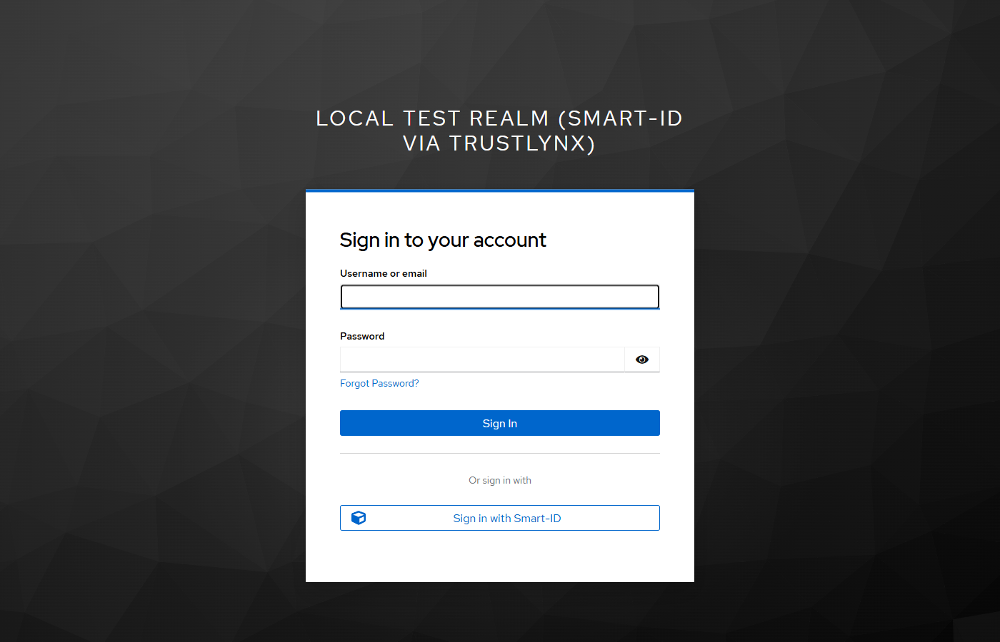

4. Click it. You arrive on the Trustlynx Keycloak landing page; pick your country tab. Selecting LV exposes the Latvian-market auth methods including **Smart-ID**:

   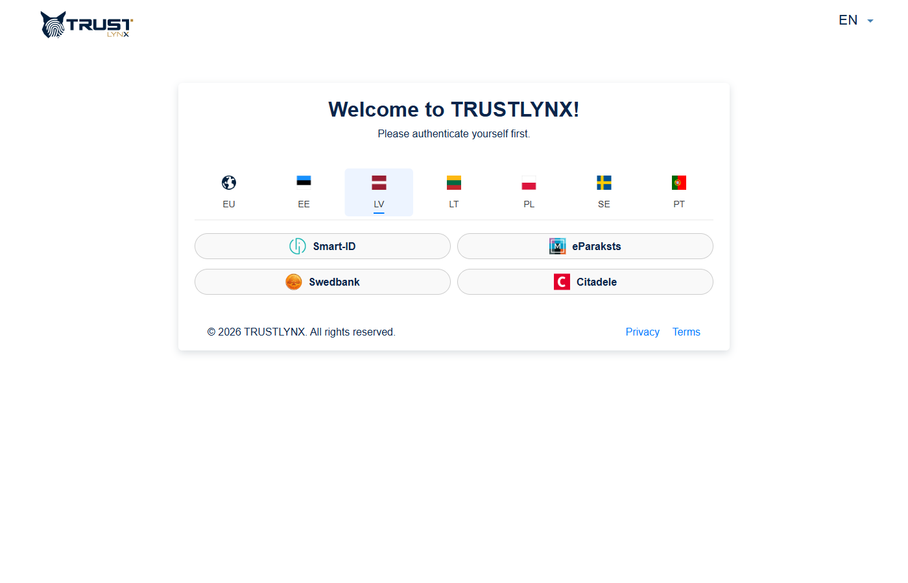

   Click **Smart-ID**. The modal appears with a QR code and a Personal ID-code input field:

   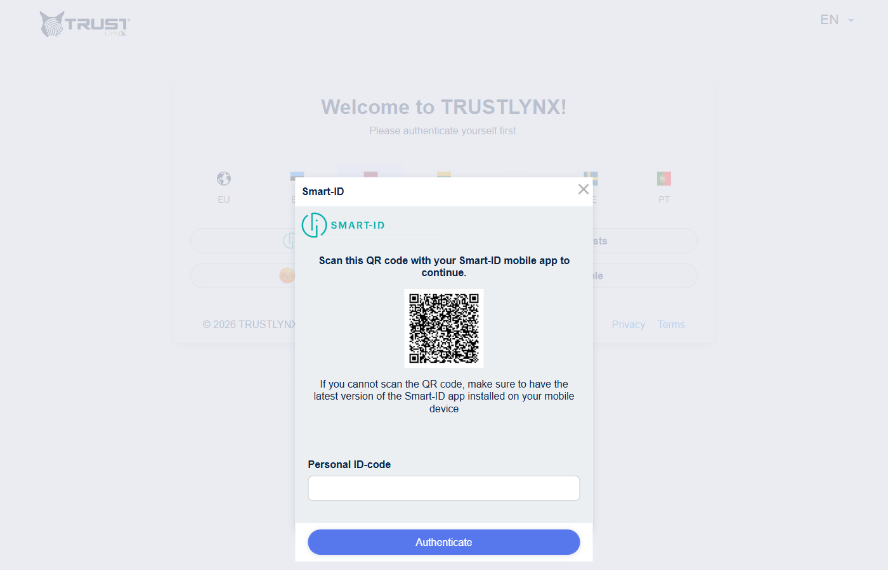

   Verify that:
   - The browser is redirected to the Trustlynx Keycloak host you were given.
   - The **Smart-ID prompt** appears immediately, showing a verification code on the screen.
   - You do **not** see a generic username/password form. If you do, the Trustlynx-side OIDC client is not bound to the Smart-ID-only flow. Contact the Trustlynx Keycloak operator.
5. Confirm the Smart-ID challenge on your phone.
6. (First login only) Submit email on the **Update Account Information** form.
7. Verify that you land on your Keycloak account console as a signed-in user.
8. In your admin console, **Users**, click on the new user, **Attributes** tab. Confirm the following are populated:
   - `personCode`
   - `country`
   - `firstName`
   - `lastName`
   - `email`
   - `authProvider` (should be `DM_SMART_ID` or `DM_SMART_ID_PLUS`)

If any of `personCode`, `country`, `authProvider` are missing while `firstName` / `lastName` are present: you have not completed Section 4.3 (realm user profile policy). Do that step and log in again. `force` sync mode will populate the attributes on the next login.

---

### 8.2. Existing-user linking flow

This is the most important scenario for production rollouts: a user **already exists in your local Keycloak**, the same person logs in via Trustlynx Smart-ID, and instead of creating a duplicate, the Smart-ID identity is linked to the existing local user. The integration's value depends on this working.

This subsection walks through the test using the test stack in this repo (`docker-compose.yml` + `realm/test-realm.json`), with the customer's actual personCode/country so the trustlynx side returns matching claims.

#### Test setup

Concretely, the existing local user used in the verified end-to-end run was:

| Attribute | Value |
| --- | --- |
| Username | `LV.180487-10948` |
| First name | `Mihails` |
| Last name | `Gordijenko` |
| Email | `mihails.gordijenko@gmail.com` |
| Password | `test` (any value the user knows, so they can re-authenticate during linking) |

The Smart-ID identity that authenticates is the same person: personCode `180487-10948`, country `LV`.

The username is **deliberately** in `<country>.<personCode>` form. That's what the Username Template Importer mapper (§4.2) produces from the Smart-ID claims, so Keycloak detects the username collision and silently auto-links via the sub-flow described in §4.4. This is **Option 1** from §4.5 (bulk rename). Option 2 (pre-create federated identity) gives the same silent end-user experience without the rename. Option 3 (self-service linking) is a gap-filler that requires the user to click an extra button.

To pre-create the user via admin API:

```bash
TOKEN=$(curl -s -X POST "http://localhost:8081/realms/master/protocol/openid-connect/token" \
  -d "grant_type=password" -d "client_id=admin-cli" \
  -d "username=admin" -d "password=admin" | jq -r .access_token)

curl -X POST "http://localhost:8081/admin/realms/test/users" \
  -H "Authorization: Bearer $TOKEN" -H "Content-Type: application/json" \
  -d '{
    "username": "LV.180487-10948",
    "firstName": "Mihails",
    "lastName": "Gordijenko",
    "email": "mihails.gordijenko@gmail.com",
    "emailVerified": true,
    "enabled": true,
    "credentials": [{"type":"password","value":"test","temporary":false}]
  }'
```

(Keycloak normalises usernames to lowercase, so the user will appear as `lv.180487-10948` in the admin console. That is fine — the username comparison is case-insensitive.)

#### Walkthrough

1. **Open an incognito window** and navigate to `http://localhost:8081/realms/test/account/`.
2. The local Keycloak login page appears with the **"Sign in with Smart-ID"** button (same as 8.1):

   

3. Click **"Sign in with Smart-ID"**. The browser is redirected to the Trustlynx Keycloak. Pick the **LV** country tab and click **Smart-ID** (same as 8.1):

   

   

4. Type personal code `180487-10948`, click **Authenticate**, confirm with PIN1 on your phone.
5. **This is where 8.2 diverges from 8.1.** With the silent auto-link sub-flow (`idp-detect-existing-broker-user` + `idp-auto-link`) configured in `realm/test-realm.json`, Keycloak detects the existing local user matching the IdP-supplied username (`lv.180487-10948`), attaches the Smart-ID identity to that user, and signs them in — **no "Account already exists" prompt, no password challenge, no Update Account form**. The browser lands directly on the account console:

   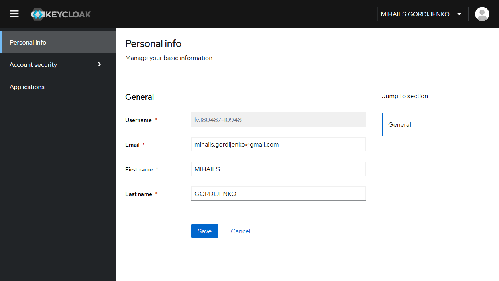

   Note in the screenshot: the username (`lv.180487-10948`), the email (`mihails.gordijenko@gmail.com`) and the user id are identical to what was set up in the pre-create step. `firstName` / `lastName` were uppercased by the FORCE sync from the Smart-ID claim. The pre-existing local password remains valid (you can still log in by username/password if you want); the Smart-ID identity is now an additional way to reach the same account.

#### Expected results (verified)

After completing the walkthrough, the following must hold. All four were confirmed in the verified end-to-end run:

```bash
# 1. Realm user count is unchanged (still 1 user, no duplicate)
curl -s -H "Authorization: Bearer $TOKEN" \
  "http://localhost:8081/admin/realms/test/users" | jq 'length'
# -> 1

# 2. The federated identity is now attached to the existing user
curl -s -H "Authorization: Bearer $TOKEN" \
  "http://localhost:8081/admin/realms/test/users/<existing-user-id>/federated-identity" | jq
# -> [{ "identityProvider": "trustlynx-smartid",
#       "userId": "<trustlynx-side-sub-hash>",
#       "userName": "<trustlynx-side-sub-hash>" }]

# 3. The user attributes show personCode/country/authProvider set by FORCE sync,
#    while existing email is preserved
curl -s -H "Authorization: Bearer $TOKEN" \
  "http://localhost:8081/admin/realms/test/users/<existing-user-id>" | jq '{username,email,firstName,lastName,attributes}'
# -> {
#      "username": "lv.180487-10948",
#      "email": "mihails.gordijenko@gmail.com",
#      "firstName": "MIHAILS",     # uppercased by Smart-ID claim FORCE sync
#      "lastName": "GORDIJENKO",   # uppercased by Smart-ID claim FORCE sync
#      "attributes": {
#        "personCode": ["180487-10948"],
#        "country": ["LV"],
#        "authProvider": ["DM_SMART_ID"]
#      }
#    }
```

What that proves:

- The integration **deduplicates** correctly when the existing local username matches `<country>.<personCode>`: no duplicate user is created.
- The Smart-ID identity is **linked** (federated_identity row attached) to the existing user, so subsequent Smart-ID logins land on the same account without prompts.
- The `FORCE` sync correctly **refreshes** the names from the Smart-ID certificate while **preserving** the existing email.
- The realm has **one user** for one human, exactly as the customer needs.

#### Failure modes to watch for

If the test does not behave as above, one of these is the cause:

- **A new user with username `lv.180487-10948` AND another user with your original username** — the silent auto-link did not fire. Possible causes:
  - Username Template Importer mapper missing or misconfigured. Verify it on the IdP (§4.2) with template `${CLAIM.country}.${CLAIM.personCode}`. Without it, the local username defaults to the trustlynx `sub` hash and no collision is detected.
  - The auto-link sub-flow inside `first broker login (Smart-ID)` is missing or has the wrong order. Verify on the realm: it must be `Auto-link existing account (Smart-ID)` (sub-flow with `idp-detect-existing-broker-user` REQUIRED + `idp-auto-link` REQUIRED) listed BEFORE `Create User If Unique`.
- **An "Account already exists" prompt appears asking for password** — your flow uses the classic Handle Existing Account sub-flow instead of the silent auto-link sub-flow. Either complete the link by typing the password, or update the realm export to the silent variant.
- **Browser shows the "Update Account Information" form (expecting an email)** — the existing local username does not match `<country>.<personCode>` and the email-collision path also did not match (Smart-ID does not emit email). Either rename the existing user (Option 2 in §4.5) or use Option 1 / Option 3.

### Where Smart-ID logins appear in your audit log

Once configured, Smart-ID logins generate the same Keycloak events as any OIDC IdP federation:

- **User events** (Realm settings > Events > User events): event type `IDENTITY_PROVIDER_LOGIN` with the `identity_provider` field set to your IdP alias from Section 4.1 (e.g. `trustlynx-smartid`). First-time logins also emit `IDENTITY_PROVIDER_FIRST_LOGIN`.
- **Admin events** (Events > Admin events): user creation by the first-broker-login flow appears as a normal `CREATE` on the Users resource.

Filter by the `identity_provider` field or by the alias to isolate Smart-ID activity from your other login methods.

---

## 9. Troubleshooting

### `invalid_request: Missing parameter: code_challenge_method` from the Trustlynx side

Your Identity Provider does not have PKCE enabled. See Section 4.1, set "Use PKCE" to ON with method `S256`.

### `invalid redirect_uri` shown on the Trustlynx login page

The redirect URI your Keycloak is sending does not match what is registered on the Trustlynx-side OIDC client. Most common cause: you changed the Identity Provider **Alias** in Step 4.1 after sending the original URI to the operator. Re-send the corrected URI:

```
https://<your-keycloak-host>/realms/<your-realm>/broker/<idp-alias>/endpoint
```

### Smart-ID is not prompted, a generic username/password form appears instead

The Trustlynx-side OIDC client is not bound to a Smart-ID-only authentication flow. This is **not fixable from your side**. Contact the Trustlynx Keycloak operator and ask them to apply the Smart-ID-only flow override to your client.

### Signature validation failed / JWKS error

The cached signing keys for the Trustlynx Keycloak realm are stale (usually after a key rotation on the Trustlynx side).

- In your Keycloak admin console: **Identity Providers >** your provider **> Settings**.
- Click **Import from URL** again to refresh the JWKS.

### User is created with `firstName` / `lastName` / `email` but `personCode`, `country`, `authProvider` are missing

You have not enabled unmanaged attributes (or declared them) in the realm user profile. See Section 4.3.

### User is created but all custom attributes are empty

Likely causes, in order of probability:

1. The mapper's **Sync Mode Override** is left at `import` instead of `force`. Change it. The user will need to log in again before attributes appear.
2. The **Claim** name in the mapper is misspelled or has wrong casing. Claim names are case-sensitive, see Section 5 for exact spellings.
3. The Trustlynx-side OIDC client is not configured to emit the claim. Confirm with the operator.

### Duplicate user / email conflict

A local user with the same email already exists. The default first-login flow will offer account linking. If you want to merge automatically, ensure **Trust Email** is enabled in the IdP settings and use a first-login flow variant that auto-links by email. This trades convenience for the small risk that the local pre-existing account was not actually owned by the Smart-ID user.

### Collecting diagnostics for support

Before opening a support request:

1. On your Keycloak server, enable `DEBUG` for the broker logger:
   ```
   org.keycloak.broker = DEBUG
   ```
2. Reproduce the failure in an incognito window.
3. Capture the `state` and `session_state` query parameters present in the URL of the **failed redirect back to your Keycloak**.
4. Share the log excerpt and those parameters with the Trustlynx Keycloak operator. They let the operator correlate the failure with their server-side logs.

---

## 10. Summary checklist

Configuration on **your** side, in order:

- [ ] Section 4.1: Identity Provider created with discovery URL, client_id, client_secret, **PKCE S256 ON**, Sync Mode `force`
- [ ] Section 4.2: Six required attribute mappers added (force sync mode)
- [ ] Section 4.3: Realm user profile, unmanaged attributes Enabled (or each custom attribute declared)
- [ ] Section 4.4: First broker login flow duplicated, Review Profile disabled, set as the IdP's First Login Flow

Out-of-band:

- [ ] Sent your broker redirect URI to the Trustlynx Keycloak operator
- [ ] Received `client_id` + `client_secret` over a secure channel

Verification:

- [ ] Section 8: end-to-end login with a real Smart-ID account succeeds; user has all expected attributes

---

## 11. Rollback

The integration is reversible. To revert, perform these steps in your existing Keycloak; nothing on the Trustlynx side needs to change.

1. **Identity Providers >** your Trustlynx provider **> Action menu > Delete**. This removes the IdP, all six required mappers, and any optional mappers you added.
2. **Authentication > Flows >** your duplicated `first broker login (Smart-ID)` flow **> Action menu > Delete**.
3. (If you enabled it in Section 4.3) **Realm settings > User profile > Unmanaged Attributes**: revert to your prior value. If unsure, "Disabled" is the Keycloak default.

Users who were provisioned via Smart-ID logins remain in your realm after rollback. Their attributes (`personCode`, `country`, `authProvider` etc.) remain on their user records but become unreachable for new mappers. Delete those users individually from the Users tab if you also want to remove the data.

No restart of your Keycloak server is required at any point.

---

## Other files in this repository

- [TESTING.md](TESTING.md), [docker-compose.yml](docker-compose.yml), [realm/test-realm.json](realm/test-realm.json): a self-contained Docker-based sandbox stack used to verify the procedure in this guide end-to-end. Useful as a working reference if your team wants to dry-run the integration in a disposable environment before applying it to production. Not required for the actual integration.
